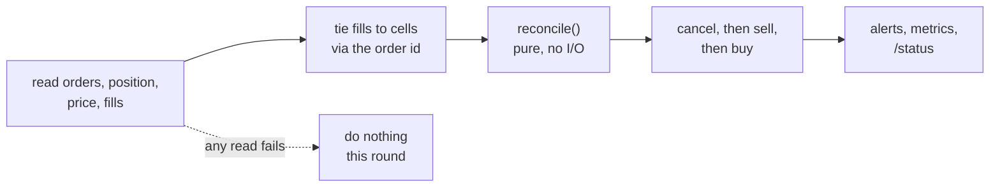
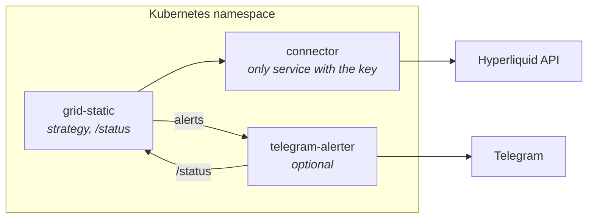

# gridstatic

A grid trading bot for [Hyperliquid](https://hyperliquid.xyz), run on Kubernetes, that keeps **no
database**. Every round it reads the exchange — open orders, position, fills — and repairs the
difference with the grid you configured. A restart, a crash or a network outage is just another
round.

[](https://github.com/njwgroeneveld/gridstatic/actions/workflows/deploy-grid-static.yml)
[](https://github.com/njwgroeneveld/gridstatic/actions/workflows/deploy-connector.yml)
[](https://github.com/njwgroeneveld/gridstatic/actions/workflows/deploy-telegram-alerter.yml)
[](https://github.com/njwgroeneveld/gridstatic/actions/workflows/publish-chart.yml)

> A personal project, built to learn reliability engineering on a system that moves money. It runs
> on Hyperliquid's testnet by default — currently a BTC grid and a Nasdaq-100 grid. Not financial
> advice, and no claim that a grid makes money.

---

## What it shows

| | |
|---|---|
| **One source of truth** | Version 0.3 kept a database next to the exchange. All three production incidents came from the two drifting apart. 0.4 removed the database: the exchange is the only state. |
| **Fail-safe by default** | An unreadable exchange is never an empty one: the round does nothing. Coin the bot cannot account for puts the grid *on hold* — no new buys, sells still go out. An unsafe config refuses to start. |
| **Incident-driven design** | Each incident is written up with its root cause and fix in [`docs/design.md`](docs/design.md), and has a regression test. |
| **Tested where it breaks** | All decisions live in one pure function. Its safety rules were each removed once to confirm a test fails without them. Assumptions were checked at the real boundary: the SDK's signatures, the testnet API, a rendered chart. |
| **Operable** | Helm chart, multi-arch images, CI gates, a one-command installer, Telegram alerts, Prometheus metrics — and no secret ever passes through Helm. |

---

## How it works

The price range is cut into lines. Each pair of neighbouring lines is a **cell**: buy on the lower
line, sell on the upper. A filled buy gets a sell; a filled sell gets its buy back.


```mermaid
flowchart LR
    R[read orders, position,<br/>price, fills] --> T[tie fills to cells<br/>via the order id]
    T --> D["reconcile()<br/>pure, no I/O"]
    D --> A[cancel, then sell,<br/>then buy]
    A --> N[alerts, metrics,<br/>/status]
    R -. any read fails .-> X[do nothing<br/>this round]
```

Four ideas carry the design:

- **The order id is the memory.** Every order's client order id encodes its grid and its cell, so
  after a restart the bot reads the book and knows where it stands — no record, no price matching.
- **One rule for unsold coin.** A cell's unsold coin is what it bought after its current sell went
  out. That covers partial fills, restarts and a crash halfway through replacing an order.
- **The position has to add up.** Before any new buy, every coin of the position must be explained
  by the bot's own orders. If not, the grid holds and alerts. A buy too few costs a cycle; a buy
  too many is [incident 1](docs/design.md#1-eight-buys-on-one-line-2026-09-09).
- **Protection lives on the exchange.** The optional stop-loss is a reduce-only stop order, sized
  to the position every round, so it fires even when the cluster is down. After a stop the grid
  resumes on its own once the price is back inside.

It also trades HIP-3 markets — stocks and indices on third-party perp dexes, such as the
Nasdaq-100 (`xyz:XYZ100`) — and decides from the mark price, because on a thin book the mid
moves with the bot's own orders.

---

## Architecture


```mermaid
flowchart LR
    subgraph k8s[Kubernetes namespace]
        GS[grid-static<br/><i>strategy, /status</i>]
        CON[connector<br/><i>only service with the key</i>]
        TG[telegram-alerter<br/><i>optional</i>]
    end
    GS --> CON --> HL[Hyperliquid API]
    GS -- alerts --> TG --> TGAPI[Telegram]
    TG -- /status --> GS
```

Three small FastAPI services, each with its own image (amd64 + arm64) and test suite, talking over
ClusterIP. Nothing is exposed outside the cluster.

---

## Incidents and what they changed

| Incident | Root cause | Now |
|---|---|---|
| Eight buys on one line | A filled line looked free: the database matched by price, the exchange filled at another | A cell is never free while the position says otherwise |
| Prices arrived as strings | `Decimal` → JSON through the database service; mocks returned floats | No database; verify at the real boundary |
| A crash on every fresh install | Startup raced the database schema migration | No database to wait for |

The full write-ups are in [`docs/design.md`](docs/design.md#incidents).

---

## Quick start

Needs a Kubernetes cluster, `kubectl`, `helm` and a Hyperliquid **testnet** account.

```bash
curl -fsSLO https://raw.githubusercontent.com/njwgroeneveld/gridstatic/master/install.sh
bash install.sh
```

It asks for your testnet key (hidden input), optionally sets up Telegram, installs the chart and
verifies that the first rounds run. Configuration, HIP-3 markets, the stop-loss, holds and the
move to mainnet are in [`docs/operations.md`](docs/operations.md).

---

## Stack

| | |
|---|---|
| Services | Python 3.11, FastAPI, httpx, `hyperliquid-python-sdk` |
| Tests | pytest — 213 tests, the decision logic covered case by case |
| Platform | Kubernetes, Helm, GitHub Actions, multi-arch images on ghcr.io |
| Operations | Prometheus metrics, Telegram alerts, a read-only consistency check (`tools/gridcheck.py`) |

```
services/grid-static/       strategy — src/reconcile.py decides, src/strategy.py acts
services/connector/         the only service that talks to Hyperliquid
services/telegram-alerter/  alerts and the /status command
chart/                      Helm chart
install.sh                  one-command installer
tools/gridcheck.py          independent check of a grid against the exchange
docs/                       design.md (why), operations.md (how)
```

```bash
for s in grid-static connector telegram-alerter; do
  PYTHONPATH="$PWD/services/$s" python -m pytest "services/$s/tests/" -q
done
```

---

## Status and next steps

Running on Hyperliquid testnet since October 2026. Proven on real data: placing and recognising
orders, tying a fill to its cell, the stop order on the exchange, a HIP-3 market. Not yet: a stop
that actually fires, and fills on a HIP-3 market.

Next: support for API wallets (an agent key that can trade but not withdraw), and making a chart
upgrade always roll every pod.
