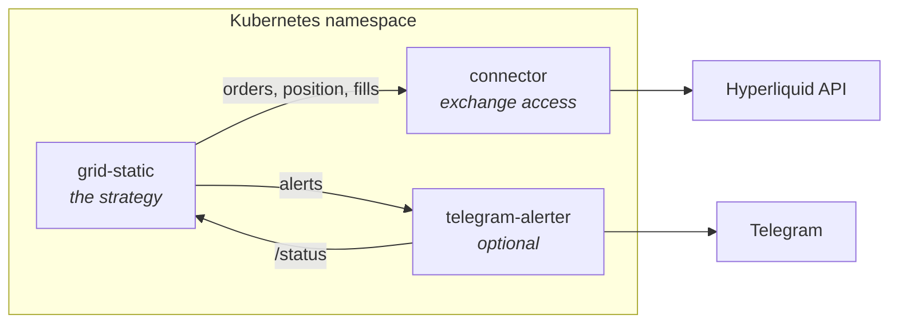

# gridstatic

A static grid trading bot for [Hyperliquid](https://hyperliquid.xyz), built as three small
services on Kubernetes and installed with a single command. It keeps no database: every round
it reads the exchange and repairs the difference with the grid you configured.

[](https://github.com/njwgroeneveld/gridstatic/actions/workflows/deploy-grid-static.yml)
[](https://github.com/njwgroeneveld/gridstatic/actions/workflows/deploy-connector.yml)
[](https://github.com/njwgroeneveld/gridstatic/actions/workflows/deploy-telegram-alerter.yml)
[](https://github.com/njwgroeneveld/gridstatic/actions/workflows/publish-chart.yml)

> **Disclaimer.** This is a personal project, not financial advice. Trading with leverage can
> lose more than you put in. Everything runs on Hyperliquid's **testnet** by default; run it there
> until you trust it before you ever point it at real funds.

---

## Contents

- [How it works](#how-it-works)
- [Architecture](#architecture)
- [Requirements](#requirements)
- [Quick start](#quick-start)
- [Manual installation](#manual-installation)
- [Configuration](#configuration)
- [Stocks and indices: HIP-3 markets](#stocks-and-indices-hip-3-markets)
- [When the grid holds](#when-the-grid-holds)
- [Going to mainnet](#going-to-mainnet)
- [Checking a running grid](#checking-a-running-grid)
- [Telegram alerts (optional)](#telegram-alerts-optional)
- [Security](#security)
- [Uninstalling](#uninstalling)
- [Upgrading from 0.3](#upgrading-from-03)
- [Development](#development)
- [Design decisions](#design-decisions)

---

## How it works

You choose a price range and a number of lines. The bot divides the range into evenly spaced
lines. Each pair of neighbouring lines is a **cell**: buy on the lower line, sell on the upper.

```
 83,000 ─────────────────────────  line 19
    ...
 77,526 ─────────────────────────  line 6    ← sell of cell 5
 77,105 ─────────────────────────  line 5    ← cell 5 bought here
 77,075 ════════ price ══════════
 76,684 ─────────────────────────  line 4    ← resting buy of cell 4
    ...
 75,000 ─────────────────────────  line 0    ← resting buy of cell 0
```

- Every empty cell below the price gets a **buy**. "The price" is the mark price, not the
  mid: on a thin book the mid is the middle of an empty spread, and the grid's own buys would
  move it.
- When a buy fills, its cell gets a **sell** one line up.
- When that sell fills, the cell is empty again and gets its buy back.
- Every completed cycle earns the distance between two lines, minus fees.

A grid does well when the price moves back and forth inside the range. It does badly when the
price leaves the range and stays out: below the range you hold every position bought on the way
down; above it, nothing is left to sell.

**The exchange is the bot's only memory.** Every order carries its cell in its client order id,
so after a restart — or a crash at any moment — the next round reads the book and knows exactly
where it stands. Before it places a single new buy, it checks that every coin of the position is
accounted for by its own orders; if not, it [holds](#when-the-grid-holds).

---

## Architecture


```mermaid
flowchart LR
    subgraph cluster[Kubernetes namespace]
        GS[grid-static<br/><i>the strategy</i>]
        CON[connector<br/><i>exchange access</i>]
        TG[telegram-alerter<br/><i>optional</i>]
    end
    HL[Hyperliquid API]
    TGAPI[Telegram]

    GS -- orders, position, fills --> CON
    GS -- alerts --> TG
    CON --> HL
    TG -- /status --> GS
    TG --> TGAPI
```

| service | responsibility |
|---|---|
| **grid-static** | The strategy. Every round: read the exchange, decide, place and cancel orders, report. Serves `/status`. |
| **connector** | The only service that talks to Hyperliquid. Holds the private key. |
| **telegram-alerter** | Optional. Sends alerts and answers a `/status` command. |

Every service is a small FastAPI app with its own image (amd64 and arm64) and its own test
suite. They talk to each other over ClusterIP; nothing is exposed outside the cluster.

---

## Requirements

| | why |
|---|---|
| A Kubernetes cluster | k3s, minikube, kubeadm — any of them |
| `kubectl` with access to it | the installation runs from your machine |
| `helm` 3 | `brew install helm`, `winget install Helm.Helm`, or the [install script](https://helm.sh/docs/intro/install/) |
| A Hyperliquid testnet account | [app.hyperliquid-testnet.xyz](https://app.hyperliquid-testnet.xyz), with test USDC from its faucet |
| Outbound internet from the cluster | to Hyperliquid, and to ghcr.io for the images |

You do **not** need a database, a StorageClass (the stack has no volumes), an ingress,
cert-manager or a service mesh.

### Give the bot an account of its own

Use a fresh account or a subaccount, and trade nothing else on it. Every round the bot checks
that the position adds up to its own orders. A position you opened by hand, or another bot on the
same coin, makes it hold — correctly, because it can no longer tell what is its own.

### Which key

| setup | `private_key` | `wallet_address` |
|---|---|---|
| the account itself | that account's key | empty |
| a subaccount | the **main** account's key | the subaccount's address |

**API wallets are not supported yet.** An API wallet trades on behalf of another account, and
the connector would read the API wallet's own, empty account instead of the one it trades for.
The bot detects this — none of its orders ever show up — and holds, but it cannot trade.

---

## Quick start

```bash
curl -fsSLO https://raw.githubusercontent.com/njwgroeneveld/gridstatic/master/install.sh
bash install.sh
```

The script asks for your testnet key (hidden input) and an optional subaccount, and then:

1. checks that `kubectl`, `helm` and your cluster are available
2. creates the `gridstatic` namespace
3. stores the key in a Kubernetes Secret
4. writes `gridstatic-values.yaml` with a default BTC grid on testnet
5. installs the Helm chart
6. **verifies the result**: all pods run, the bot started its grid, and its first rounds run
   without errors — or tells you it is on hold, and why

You end with a single verdict: done, or what went wrong and where to look.

> **Check the bounds.** The default grid runs from 75,000 to 83,000. Testnet prices drift from
> mainnet; if the testnet price is outside that range, edit `gridstatic-values.yaml` and upgrade
> (see [Changing a running grid](#changing-a-running-grid)).

| option | |
|---|---|
| `--dry-run` | show every step without touching anything |
| `--namespace`, `--release`, `--chart` | override the defaults |
| `GRIDSTATIC_HL_KEY`, `GRIDSTATIC_HL_WALLET` | skip the questions (useful in automation) |

The key deliberately has no command-line flag: it would end up in your shell history. Re-running
the script is safe; it reuses the Secret and upgrades the release.

---

## Manual installation

The same steps by hand, if you prefer to see each one.

**1. Namespace**

```bash
kubectl create namespace gridstatic
```

**2. The Hyperliquid secret**

This chart contains no keys and creates no Secrets — you create them and pass only their names
(see [Security](#security) for why).

```bash
read -rsp 'Private key: ' HL_KEY; echo
read -rp  'Subaccount address (empty for none): ' HL_WALLET
kubectl -n gridstatic apply -f - <<EOF
apiVersion: v1
kind: Secret
metadata:
  name: gridstatic-hyperliquid
type: Opaque
data:
  private_key: $(printf '%s' "$HL_KEY" | base64 | tr -d '\n')
  wallet_address: "$(printf '%s' "$HL_WALLET" | base64 | tr -d '\n')"
EOF
unset HL_KEY HL_WALLET
```

This looks more roundabout than `kubectl create secret --from-literal=...`, on purpose. With
`--from-literal` the key lands in your shell history and in the process list. Here it is read
with hidden input, handed to `base64` over a pipe, and sent to `kubectl` over stdin.

**3. Values** — create `gridstatic-values.yaml`:

```yaml
hyperliquid:
  testnet: true
  existingSecret: gridstatic-hyperliquid

grid:
  startBalance: 1000
  coins:
    BTC-20:
      coin: BTC
      active: true
      allocationPct: 100
      upper: 83000
      lower: 75000
      numLines: 20
      leverage: 1
```

**4. Install**

```bash
helm install gridstatic oci://ghcr.io/njwgroeneveld/charts/gridstatic \
  -n gridstatic -f gridstatic-values.yaml
```

**5. Check**

```bash
kubectl -n gridstatic logs deploy/gridstatic-grid-static -f
```

The bot should log `started: 20 lines 75000-83000, $40.0 per line, 1x`, followed by a `BUY` line
for every cell below the price. If it logs `Refusing to start`, the message below it names the
setting it will not trade with.

---

## Configuration

All settings live in your values file. The full list with comments is in
[`chart/values.yaml`](chart/values.yaml).

### Grids

```yaml
grid:
  strategyAllocationPct: 80       # share of startBalance available to all grids
  startBalance: 1000              # basis for order sizing -- see below
  roundIntervalSeconds: 30        # how often the bot reads the exchange and repairs the grid
  fillLookbackHours: 72           # how far back it looks for coin a cell bought but did not sell
  coins:
    SOL-20:                       # free-form label, used in logs and alerts
      coin: SOL                   # Hyperliquid symbol
      active: true
      allocationPct: 100          # this grid's share of the strategy allocation
      lower: 93
      upper: 107
      numLines: 20
      leverage: 1
```

**Order size per line** is fixed:

```
startBalance × strategyAllocationPct% × allocationPct% ÷ numLines
```

With the defaults above, 1000 × 80% × 100% ÷ 20 = **$40 per line**, and up to $760 in the
market if all 19 cells fill. The size does not grow with profit: the profit since the start is
not something the exchange can report once its fill history rolls over, and the bot keeps no
record of its own.

A grid can set its own `startBalance`, which then overrides the global one for that grid. That
fits grids that margin from different balances — BTC from your regular perps account, a HIP-3
market from its own dex:

```yaml
    NDX-20:
      coin: "xyz:XYZ100"
      startBalance: 500            # this grid only; the others keep grid.startBalance
```

`startBalance` is not read from your account. The bot deliberately does not size from your
account value: that value moves with unrealised losses, so lines would shrink exactly while the
grid is buying its way down. At startup it compares what a full grid needs with your account
value and warns if the account cannot carry it.

**The bot refuses to start** — with a message that names the problem — when:

| | why |
|---|---|
| an order would be under $10 (leverage counts) | Hyperliquid rejects it, and the cell would stay empty |
| two grids trade the same coin | the exchange keeps one position per coin; two grids cannot tell theirs apart |
| a grid says `shadow: true` | shadow mode is gone; starting would place real orders for a grid you believe is simulated |
| `startBalance` is missing | it sizes every order; there is no safe default |

`grid.coins` has no default: the chart refuses to install without an active grid. That is on
purpose — Helm merges maps, so a default grid would quietly run next to the ones in your file.

### Other settings

| key | default | |
|---|---|---|
| `hyperliquid.testnet` | `true` | `false` means mainnet and real money |
| `hyperliquid.existingSecret` | *(required)* | Secret with `private_key` and `wallet_address` |
| `telegram.enabled` | `false` | deploys the alerter |
| `telegram.existingSecret` | empty | Secret with `bot_token` and `chat_id` |
| `scheduling.nodeSelector`, `scheduling.tolerations` | empty | pin the pods if you need to |
| `resources` | 64Mi / 50m requested | applied to every service |
| `images.*.tag` | `latest` | pin a commit SHA for reproducible deploys |

### Changing a running grid

Edit your values file and upgrade:

```bash
helm upgrade gridstatic oci://ghcr.io/njwgroeneveld/charts/gridstatic \
  -n gridstatic -f gridstatic-values.yaml
```

> **Changing `coin`, `numLines`, `lower`, `upper` or `leverage` makes a new grid.** Every order
> carries a fingerprint of exactly those five settings. After the change, the old grid's orders
> carry a different fingerprint: the bot leaves them alone, but it also holds — its position no
> longer adds up. Cancel the old orders and close or keep the old position deliberately before
> you change them. Changing `allocationPct` or `startBalance` is safe; it applies to new orders.

---

## Stocks and indices: HIP-3 markets

Hyperliquid also lists markets deployed by third parties on perp dexes of their own (HIP-3) —
the Nasdaq-100, single stocks, commodities. Their names carry the dex: `xyz:XYZ100` is the
Nasdaq-100 on the `xyz` dex. Use that full name, quoted:

```yaml
grid:
  coins:
    NDX-20:
      coin: "xyz:XYZ100"
      active: true
      allocationPct: 100
      upper: 32000
      lower: 29000
      numLines: 20
      leverage: 1
```

The chart passes the dex on to the connector; nothing else to configure. Three things differ
from a regular market:

- **Each HIP-3 dex keeps its own balance.** USDC on your regular perps account does not margin
  an `xyz` position. Move USDC to that dex first — a `sendAsset` transfer to it, or enable dex
  abstraction so the account shares collateral across dexes. The startup margin check reads the
  balance of the coin's own dex and warns if it is short.
- **Check the market on the network you use.** A market can be busy on mainnet and nearly empty
  on testnet. On testnet a grid there mostly tests the plumbing: with no one trading, its orders
  rarely fill.
- **Look at the market's own rules** in its listing — maximum leverage, isolated-only, trading
  hours — before you pick a leverage.

`tools/gridcheck.py` handles HIP-3 coins the same way.

---

## When the grid holds

On hold, the bot places **no new buys**. It still places sells for coin it can account for, and
it resumes by itself as soon as the cause is gone. You get a `grid_hold` alert with the reason,
and a `hold_cleared` alert when it resumes. `/status` shows it too.

| reason | what to do |
|---|---|
| the position has coin no cell accounts for | a manual position, another bot on the coin, or fills older than `fillLookbackHours`. Close the extra position, or sell it yourself. |
| orders from an earlier grid on this coin | you changed the grid's bounds, lines or leverage. Cancel the old orders, or restore the old settings. |
| resting sells exceed the position | someone sold coin the bot had a sell for. Cancel the excess sell. |
| none of the orders placed last round is on the book or filled | the bot reads another account than it trades on. Check `wallet_address` — see [Which key](#which-key). |
| short position | a grid only ever holds long. Close the short. |

The rule behind it: a buy too few costs one missed cycle; a buy too many is how a grid once
bought the same line eight times. See [`docs/design.md`](docs/design.md).

---

## Going to mainnet

Manual on purpose. Run on testnet until the grid has done what you expect for long enough to
trust it, then:

1. Create a Secret with your **mainnet** key, the same way as the testnet one — a separate
   account or subaccount with a balance you are willing to lose.
2. In `gridstatic-values.yaml`, set `hyperliquid.testnet: false` and point
   `hyperliquid.existingSecret` at the new Secret.
3. Check the bounds against the mainnet price, and the size per line against your balance.
4. Upgrade, and read the first rounds in the log:

```bash
helm upgrade gridstatic oci://ghcr.io/njwgroeneveld/charts/gridstatic \
  -n gridstatic -f gridstatic-values.yaml
kubectl -n gridstatic logs deploy/gridstatic-grid-static -f
```

The testnet orders stay on testnet; nothing carries over.

---

## Checking a running grid

**What the bot sees** — every cell, the position, and whether it holds:

```bash
kubectl -n gridstatic port-forward svc/gridstatic-grid-static 8080:8080
curl -s localhost:8080/status
```

**An independent check** — `tools/gridcheck.py` reads your grid settings from the cluster and
your account straight from Hyperliquid's public API: no key, no connector, nothing changed.

```bash
pip install pyyaml
python3 tools/gridcheck.py --address 0xTHE_ACCOUNT_THE_BOT_TRADES_ON
```

| check | what it catches |
|---|---|
| no orders from an earlier grid | a settings change that left orders behind |
| at most one buy and one sell per cell | duplicate orders |
| every sell is reduce-only, no buy at or above the price | orders that could open a short or cross the book |
| the position adds up to the bot's own orders | anything that would make the bot hold |
| what the next round would place or cancel | a grid that is not complete when it should be |

It needs `kubectl` access to the namespace (or `--settings settings.yaml`) and Python 3.

---

## Telegram alerts (optional)

Create a bot with [@BotFather](https://t.me/BotFather). **Use a token that no other application
listens on** — Telegram allows only one listener per token, and two would take updates away
from each other.

```bash
read -rsp 'Bot token: ' TG_TOKEN; echo
kubectl -n gridstatic apply -f - <<EOF
apiVersion: v1
kind: Secret
metadata:
  name: gridstatic-telegram
type: Opaque
data:
  bot_token: $(printf '%s' "$TG_TOKEN" | base64 | tr -d '\n')
stringData:
  chat_id: "YOUR_CHAT_ID"
EOF
unset TG_TOKEN
```

```yaml
telegram:
  enabled: true
  existingSecret: gridstatic-telegram
```

You get alerts when a buy fills, a cycle closes (with its profit after fees), the grid goes on or
off hold, the price nears or leaves the range, and when something fails — plus a `/status`
command with a cell-by-cell view of every grid. With Telegram disabled, alerts fail silently and
the bot keeps running.

---

## Security

**What this setup does.** Your exchange key never passes through Helm. That matters: Helm stores
the values you install with in a Secret in your cluster (`sh.helm.release.v1.<name>.v1`), and
`helm get values` prints them back to anyone allowed to run it. Secrets are read with hidden
input and sent to `kubectl` over stdin, so they never reach your shell history or the process
list. CI fails if the chart ever renders a Secret, or if `install.sh --dry-run` prints the key.

Sells are always placed **reduce-only**: whatever the bot believes, a sell can never open a short.

**What it does not do.** Kubernetes Secrets are base64-encoded, not encrypted. Without encryption
at rest on etcd they are readable on your control-plane node's disk, and anyone with `get
secrets` in the namespace can read them. For more, look at sealed-secrets, external-secrets or
SOPS.

The key in the Secret can withdraw funds. Keep only what the grid needs on that account.

---

## Uninstalling

```bash
helm uninstall gridstatic -n gridstatic
kubectl delete namespace gridstatic
```

Uninstalling stops the bot, not the orders it placed: cancel them and close the position on
Hyperliquid yourself. Installing again with the same grid settings picks the grid up where it
was — the orders still carry its fingerprint.

---

## Upgrading from 0.3

0.4 removes the database and shadow mode.

- **Shadow grids** never placed orders, so there is nothing to carry over: uninstall 0.3, create
  a testnet key Secret, remove `database` and every `shadow` from your values file, and install
  0.4. The chart refuses a grid that still says `shadow: true`.
- **Live grids** placed their orders without a cloid, so 0.4 does not recognise them. With a
  position open it holds; with only resting buys it places its own buys next to them. Either
  way: cancel the 0.3 orders and close the position before you upgrade.
- The database and its Secret are no longer used; delete them when you no longer need the history.

---

## Development

```
services/grid-static/        the strategy -- src/reconcile.py decides, src/strategy.py acts
services/connector/          Hyperliquid access
services/telegram-alerter/   alerts and /status
chart/                       the Helm chart
tools/gridcheck.py           read-only check of a grid against the exchange
install.sh                   one-command installer
docs/design.md               design decisions and the incidents behind them
```

Run the tests (178 in total):

```bash
for s in grid-static connector telegram-alerter; do
  PYTHONPATH="$PWD/services/$s" python -m pytest "services/$s/tests/" -q
done
```

Lint the installer (`pip install shellcheck-py` ships the real binary):

```bash
shellcheck install.sh
```

**CI.** Each service has a workflow that runs its tests and builds a multi-arch image when its
directory changes. The chart workflow lints and renders the chart and enforces its rules, each
checked for the right reason: installing without `hyperliquid.existingSecret` fails, a grid with
`shadow: true` fails, testnet is the default, nothing refers to a database, and the chart never
renders a Secret. A separate workflow runs `shellcheck` and dry runs of `install.sh` that fail if
the key shows up in the output or an invalid key is accepted.

---

## Design decisions

[`docs/design.md`](docs/design.md) explains the choices behind this setup — why the exchange is
the only source of truth, how a cell is recognised through the client order id, when and why the
grid holds, why secrets bypass Helm — and the production incidents that led to several of them.
